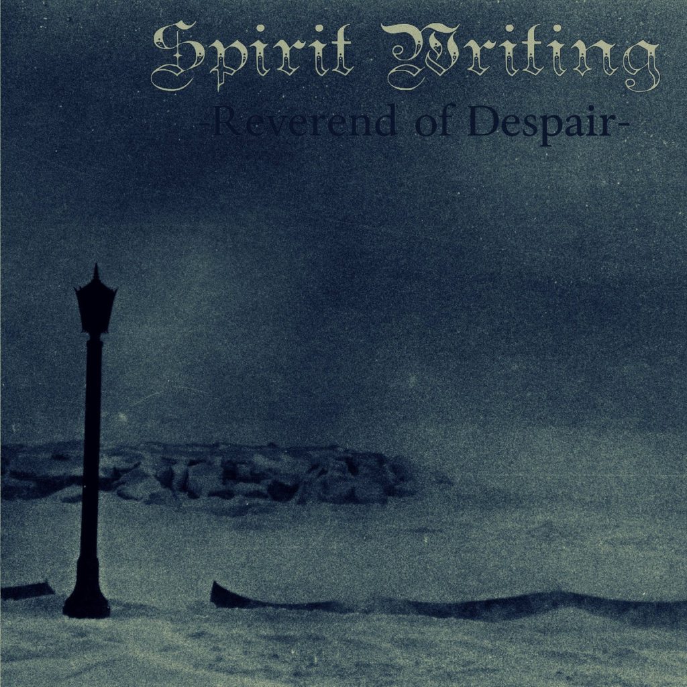
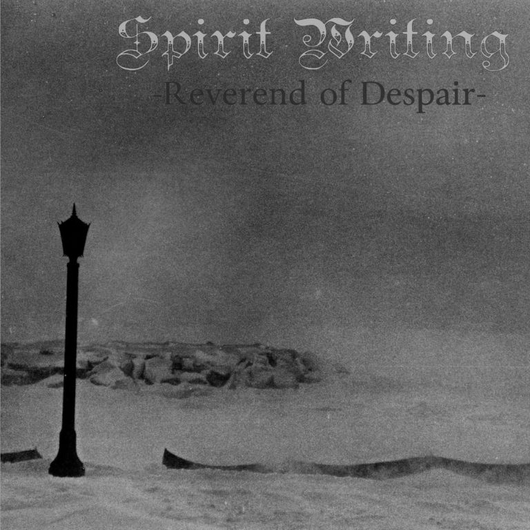
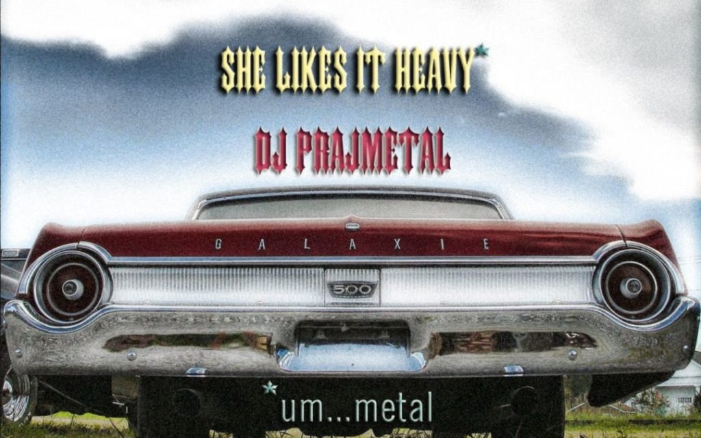

## 1. *Spirit Writing* Album Review by D. Kelvin of Forgotten Songs

*Spirit Writing album blue*

Here what the so-called *Reverend of Despair* (his real name is Victor Fisher and he's from a band called *Shroud of Delirium*) wrote on *Encyclopaedia Metallum* to present this album: "I have been working on this new solo project due to the absence of my band. Although plagued by mediocre production (alternate: although blessed with obscure production) I thought this may interest some of you. It's doom-based eclectic madness! Heavy music has done me plenty of good. Maybe if even a single odd fellow will enjoy this effort it was well worth it."

So here is my answer. I'm among the ones to consider that this kind of production is a blessing and not a plague. Moreover I not only enjoy this effort, I consider it as one of the best surprises of the year, and I listen to quite a large amount of music in doom-sludge-black metal-atmospheric post rock and other experimental delirium. But here, I literally found in love with this unexpected mix of so much genres, styles and sounds that nobody had the idea to telescope. It's Black Sabbath meeting Roky Erickson meeting Buzzcocks meeting whatever has some sense of melody in doomland and even Nikki Sudden. And the fact that there is a real feeling of artisanal humanity that flows from it make it not only a worth but a mandatory acquisition.

That'll be my last word. Do some more in the future please, we need such albums in our dull lives. [Here's](http://reenchantment.bandcamp.com/) the Bandcamp. [Here's](https://reenchantment.bandcamp.com/album/spirit-writing) the album. Moreover his favorite citation is said to be "In heaven all the interesting people are missing." from Nietzsche, and honestly, he's right. And visiting his facebook page, it seems to be politically quite rough and citing Stalin and Proudhon, not common in this country. Support.

## 2. *Spirit Writing* Album Review by Marcel H. of Lords of Metal

*Spirit Writing album grey*

What the flying f**k have I got here? Weird samples of spoken words that seem to be delivered by a rapper, electronic beats. What the hell does this have to do with doom? Yes, I know, a band name doesnt say a thing, but mister Reverend Of Despair himself describes his music as doom. I know that that isnt the be all and end all either (case in point Alexi Laiho who once said that Children Of Bodom played black metal) but the entire package screamed doom metal at me.

After three totally alienating songs of which song number three asks How Enlightened Are You? (well, totally not at all it seems), we get The Grieg And Euphorization Revealed and lo and behold here is the doom that was promised, even though the heavily distorted vocals still make it as alienating as can be. And what the hell is A Plastic Paradise? Rap/funk doom? And it just keeps on going on like this on the entire album. Really, almost everything is fired at the listener even though it is clear that all the time its the same band/man/project. A song such as The Curse Of The Gothic Rainberries At Deaths Door (the song title alone is enough to make me scream) is doom once again. After having listened to this album about twenty times I am still not sure, this is pure genius or the biggest junk ever. It has been very long ago, if at all, that an album has left me behind this confused. 

Congratulations, mister Reverend Of Despair for achieving something extremely rare. That fact in itself deserves my fullest respect. Oh yeah, the last four songs are by Reverend Of Despairs full band Shroud Of Delirium but fit snugly with the rest of the songs featured here. Grading this work is an impossible task. My advice to everyone is, check this out for yourselves and lets see if you get just as confused as me.

## 3. *Demo 2019* Review by Ted Nubel of The Chicago Doom Confederacy

*Demo 2019*

Strange People In Pain is the latest project from a rather mysterious figure formerly known as "The Lord Reverend Wizard of Alchemical Despair", or more colloquially, Victor Fisher. I first met Victor when he joined Sacred Monster as a vocalist for a few months, way before we even recorded our first EP. That didn't work out due to time constraints, but in the short while that he was in the band, it was apparent that Victor was in a league of his own, musically and otherwise -- he operates on a different plane of existence than most of us mortals. That's especially apparent with his latest project, "Strange People In Pain", which he's kicked off recently with a two-song demo that showcases the different aspects of the sound and its basis in philosophical musings.

The opener, "They'll Come For You (Mermaid Version)", is a relaxed atmospheric rock track, though the chord progressions feel rooted in 70's rock (Jefferson Airplane, Fleetwood Mac particularly) to me, with obvious psychedelic influences. Victor and his co-conspirator Aaron Schreiber have created an extremely comforting vibe here even with some demo aspects in the sound -- programmed drums, some digital-feeling tones at points -- that's relaxing to listen to. That's kind of a juxtaposition with the depressing lyrical content, which lambasts the tendencies of modern society to restrict free will and education.

On the flip side is "The Ritual", with a doomier sound closer to T.L.R.W.o.A.D.'s previous output. It feels almost like a black metal lens cast upon the atmospheric rock of the opening track, which averages out to a slow, evil and groovy affair with harsher vocals. Still present here are the 70s-feeling progressions and adept manipulation of melodies to craft something that's far more than just a few riffs stapled together. So, think first-wave black metal riffs tied together with Black Sabbath trimmings and you're getting there.

Victor is not one for convention, which is why to listen to this demo in the intended order you'll need to hit up the [band website](http://reenchantment.band), where you can also check out the backstory on the band, which has been written in a sort of tongue-in-cheek historical retrospective tone.

I end up running into Victor every couple of years -- sometimes physically, sometimes through email, and it's always nice to see what he's up to. Fun fact -- a while back he filled in on bass with Sacred Monster at a Mutiny show for a single cover of Black Sabbath's "Snowblind", which also makes him, technically, a live member. I can't really predict what he'll be up to next, but make sure you listen to this latest iteration.

You can find the demo here:
  1. [They'll Come For You](https://songs.reenchantment.band/theyll-come-for-you/)
  2. [The Ritual](https://songs.reenchantment.band/the-ritual/)

## 4. *The Ritual* Song Review by DJ Prajmetal of She Likes It Heavy Radio Show

*She Likes It Heavy radio show*

Victor Fisher, aka The Lord Reverend Wizard of Alchemical Despair, aka the infamous Bruce's Crain's acquaintance is mostly a philosophizer that lends his wholly compelling and uniquely creepy vocal to a wonderfully emotionally-laden [black metal](https://articles.victorslibrary.com/the-ritual/). I listened to this on repeat.

[Original Post](http://reject.libsyn.com/she-likes-it-heavy_show-328_110519)