## 2006
- Victor Fisher started playing guitar after discovering classic rock bands like *The Beatles*, *Queen*, *Led Zeppelin*, *Deep Purple*, *Steppenwolf*, *Creedence Clearwater Revival*, *Rare Earth* and *Jefferson Airplane*.

- Victor had previously been a violin player in school orchestra with an interest in folk music, disco music and movie soundtracks.

## 2007

- After getting into heavier bands such as *Slayer*, *Metallica*, *Lamb of God*, *Melechesh*, and *Amon Amarth*, Victor was inspired to discover what the heaviest possible music is. This lead to an intense interest in doom metal and black metal.
- Victor participated in a short lived rock band called Lamp.
- Victor started a band called *[Shroud of Delirium](https://reenchantment.bandcamp.com/album/the-former-shroud-of-delirium)* with David Sommer on drums. Aaron Schreiber became the bassist shortly afterwards by playing a middle eastern sounding scale that seemed very impressive at the time. The band mostly played doom metal songs with a black metal influence such as *Follow the Light*, *The Ritual*, and *Hypnotics*. They played live multiple times at at a hookah bar called *Swingstate* that is no longer in existence.

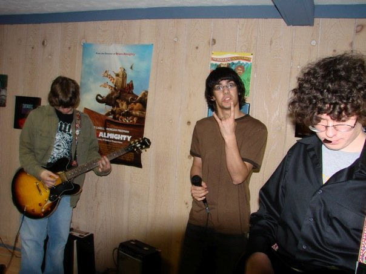
*Lamp band practice*

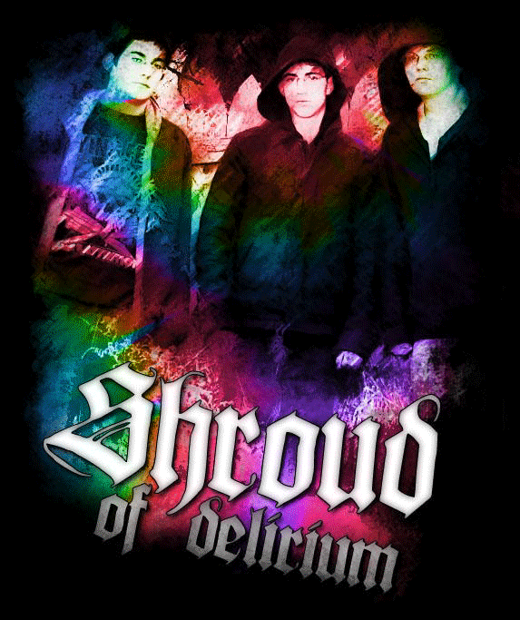
*Shroud of Delirium Animation by Kevin Auvinen*

## 2008

- *Shroud of Delirium* entered a psychedelic period in 2008.
- Victor was into stoner movies like *Dig!*, *Dazed & Confused* and *This Is How We Trip* at the time. He also loved conspiracy documentaries on *Google Video* like *Zeitgeist* and *America: Freedom to Fascism*.
- Victor added lighter songs such as *They'll Come For You* and *Remember* to the set.
- A short lived project called *Jeff's After School Special* was formed.

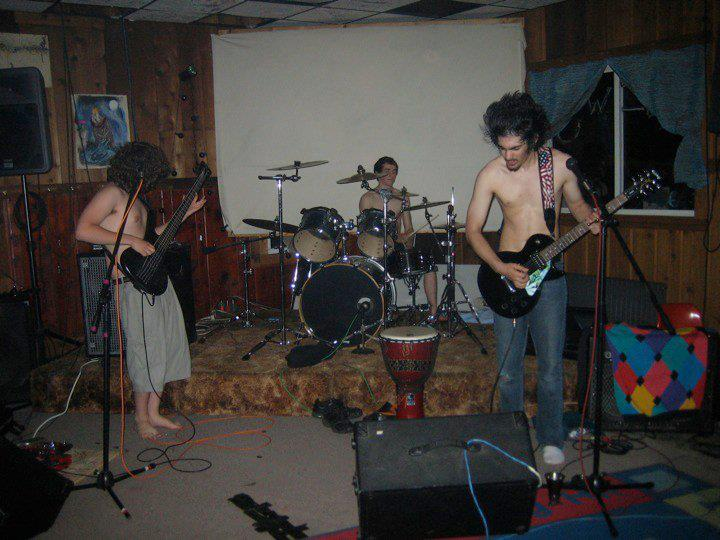
*Shroud of Delirium live at Swingstate*

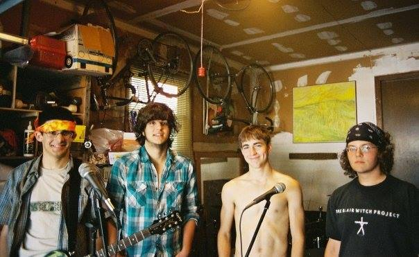
*Shroud of Delirium with Jeff Smith*

## 2009

- *Shroud of Delirium* radically slowed down their tempos due to an increased interest in funeral doom and drone doom.
They also became interested in spiritual practices such as meditation and ritual.

*The Commune*

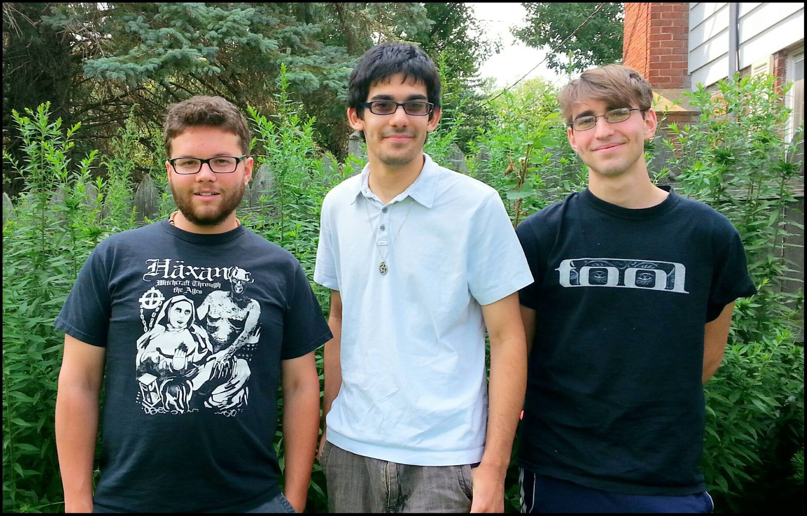
*Shroud of Delirium reunion*

## 2010

- Aaron visited a spiritual community in New Mexico called *[The Lama Foundation](https://www.lamafoundation.org/)* and eventually became their treasurer.
- Due to the fact that the band was starting to wane, Victor started a solo project called *The Lord Reverend Wizard of Reverend of Despair*.
- Victor also started a radio show called *Reverend Radio* on *[WMXM 88.9 FM](https://wmxm.org/)* Lake Forest College radio. The name was later changed to *tReverend Radio* with cohost *DJ Dealer* (Trevor Nykaza), and then subsequently *Victor's Astrology Hour*.

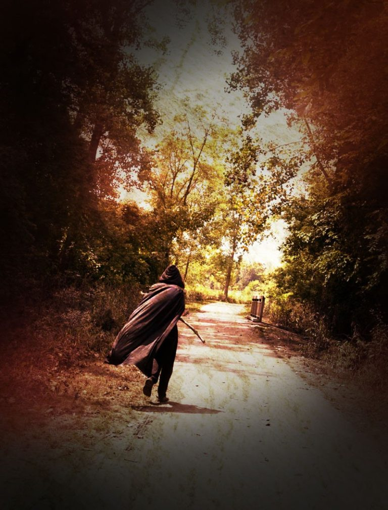
*The Reverend of Despair photographed by Mary Ekern*

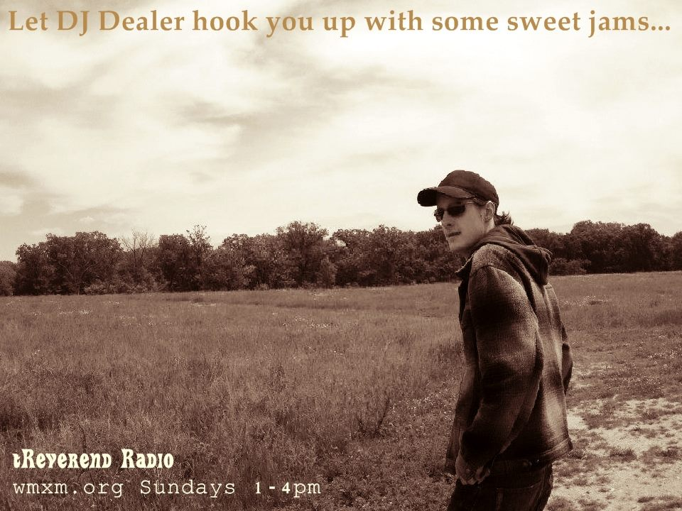
*DJ Dealer of tReverend Radio*

## 2011

- Victor became increasingly interested in the occult.
- Victor recorded an eclectic album called *[Spirit Writing](https://reenchantment.bandcamp.com/album/spirit-writing)*. It had a pleasantly underground feel to it.

## 2012

Victor recorded an even more eclectic album called *[At the Edge of the World](https://reenchantment.bandcamp.com/album/at-the-edge-of-the-world)* that had a much bigger and more polished sound.
Here is a quote that was used to spread the malevolent influence of the album:

> We, His Excellency The Lord Reverend Wizard of Alchemical Despair Himself! By the Grace of God, Emperor and Autocrat of All Underground Heavy Metal and Rock and Roll Music and the Most Feared D.J. on All Radio, et cetera, et cetera, et cetera Hereby Pronounce "At the Edge of the World" to be the Greatest Recording Ever Created For All Time With No Exception and Deem It Mandatory to Listen to This Record, For All Able Bodied Souls Within the Confines of The Reverend's Magnificently Glorious and Eternal Empire.

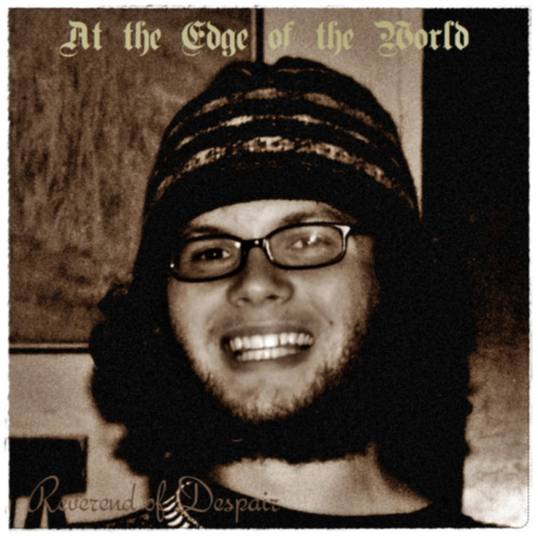
*Aaron depicted on the cover of Victor's album.*

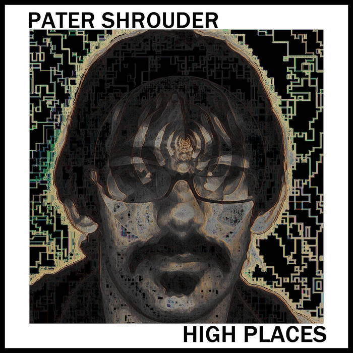
*Victor depicted on the cover of Aaron's song.*

## 2013

- Aaron started a solo project called *[Pater Shrouder](https://patershrouder.bandcamp.com/)*.
- Aaron and Victor completed a powerful and violent ritual known as *The Night of Nine Rites*.

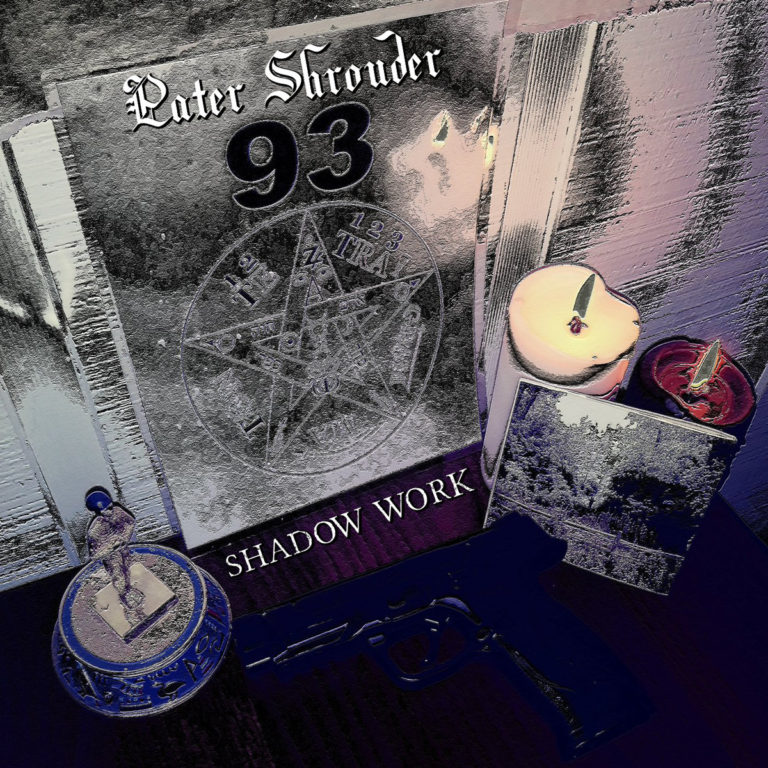
*Pater Shrouder's altar*

## 2014

- Victor and Aaron collaborated on a strange and awesome project known as *[The 666 Names of Aleister Crowley](https://patershrouder.bandcamp.com/track/666-names-of-aleister-crowley-demos)*.

## 2015

Victor graduated from Lake Forest College with a degree in music and religion.

## 2016

- Victor created controversial website called *Right Wing Occultism* that covered news about witchcraft from around the world. Although it generated traffic, it shut it down due to security concerns.
- Victor and Aaron were also involved with a mysterious occult group known as *The Shadow Work Society*.

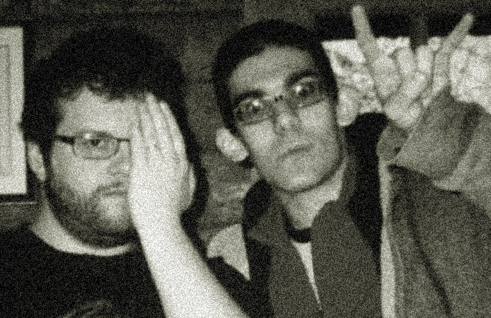
*The Shadow Work Society*

*The Reverend of Despair is objectively evil.*

## 2017

- Victor created a new version of his website called *The Deep Research Archive* . It was also occult themed.

## 2018

* Victor began a formal study of computer programming and was able to create the first truly stable version of his website. It was called *victorslibrary.com* and was written with *Wordpress.org*.
- The recording quality for Victor's music improved with recordings like *They'll Come For You*, *The Ritual*, *The Ceremony of Forgiveness*, and *Otherworldly Dream Magic*.
- Victor debated whether his musical project should be called *Strange People in Pain*, *The McKenna Method*, or *Reenchantment*. He ended up settling on the latter.

## 2019

- Victor became interested in information science to improve his research and cataloging abilities.
- He did a lot of writing and recording for the website. The main goal was to release demo versions of every song.

## 2020

- Victor created a second stable version of his website called *reenchantment.band*. It was written in a more developer friendly framework called *Gridsome*. The code was more custom and had better performance, although he wasn't able to continue the process due to problems with the architecture.
- Victor also started to work on recording demos to copyright all of his songs.

## 2021

- Victor was able to finish copyrighting his songs.
- He also completed a major update of his musical equipment.

## 2022

- Victor improved his video production quality.
- He decided to adopt a three pronged media strategy of music, blogging, and podcasting.
- He also started to develop a parapsychology laboratory.