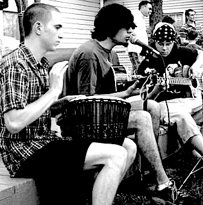

Around the year two thousand and six, a troubled artist known as *The Lord Reverend Wizard of Alchemical Despair* discovered a collection of sacred relics on the very fringes of our reality. These priceless and terrifying artifacts provided  an extraordinary glimpse into the mysteries of rock music and the dark arts.

*The Reverend of Despair suffers from a rare form of psychosis*

*The Reverend of Despair* immediately began assembling a team of experts known as *Shroud of Delirium* to help him disseminate this revolutionary information to the wider world. A secret bunker was chosen as the primary base of operations, and couple of nearby encampments were also used for ceremonial purposes. Some extraordinary results were obtained.

*Shroud of Delirium backyard show*

After the initial experiments were concluded, *The Reverend of Despair* ventured forth and was able to take control of a local [radio station](https://wmxm.org/). Comrade Aaron took a differing approach by fleeing into the wilderness and joining a [commune](https://www.lamafoundation.org/).

It was around the year two thousand and eighteen that *The Reverend of Despair* acquired the skills to engineer a state of the art propaganda distribution system. To this very day, he remains on the front lines of a crusade to reenchant the world. As Kipling wrote:

> "The individual has always had to struggle to keep from being overwhelmed by the tribe. If you try it, you will be lonely often, and sometimes frightened. But no price is too high to pay for the privilege of owning yourself."  
> – Rudolph Kipling

There is a transcendent power that shines through his art, and he is dedicated to bringing it down to earth.